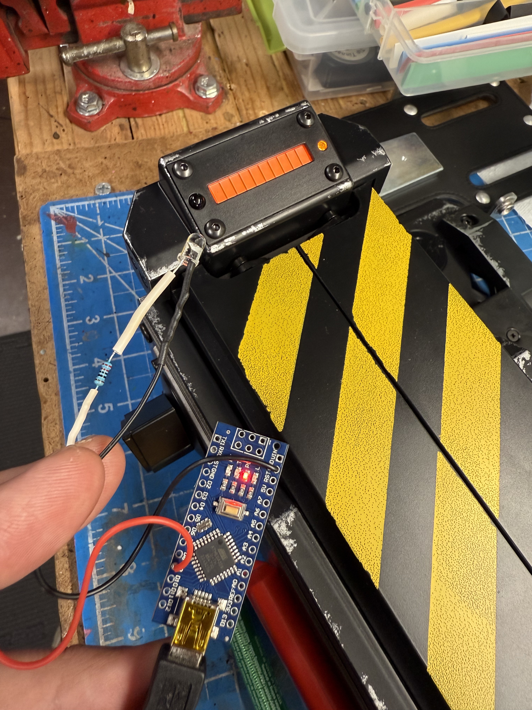

# Ghost Signals

Provides a simple means of triggering the ghost sounds from the Haslab Ghost Trap using infrared signals. Requires a microcontroller paired with an IR LED using the "IRremote" library. This project's code example uses an Arduino Nano but could be adapted for other boards (eg. Arduino Mega, ESP32, etc.).

## How It Works

When the Haslab PKE Meter is set to full power (wings fully up) there is a single visible pulse of IR data sent from an LED behind the taser lens. Most cameras empoy an IR cut filter making this invisible, but you can see an example of this behavior through use of a full-spectrum camera, which removes the cut filter and allows isolating the IR light by using a 850nm IR filter:

[(Video in MP4 Format)](Video/IR_Blast.mp4)

To capture the signal, a Flipper Zero was used to record the IR signal from the PKE as a "remote". The resulting data reveals a typical 38kHz carrier frequency with a total of 19 pulses of varying but consistent duration (in microseconds) for the signaling. Replaying the signal proved there is no obvious differences in the data, meaning a single command triggers a ghost sound every time: [Proof of Concept (Video in MP4 Format)](Video/POC.mp4)

## Bill of Materials

* 1x Microcontroller (default: Arduino Nano)
* 1x IR LED (Tested with 940nm, 850nm possible)
* 1x Resistor (Tested with 220ohm, 180ohm possible)

### Assembly / Software

1. Put the resistor on the anode (+) leg of the LED and connect to pin D9
1. Attach the cathode (-) of the LED to GND on the microcontroller
1. Download the [Arduino IDE](https://www.arduino.cc/en/software) if you do not already have it installed
1. Open the Arduino sketch from the `GhostSignals` folder
1. Install the "IRremote" library via the Arduino IDE library manager
1. Upload the Arduino sketch to the microcontroller

That's it!

The current software will simply pulse the signal every 5 seconds. Do what you will with this information in your projects!